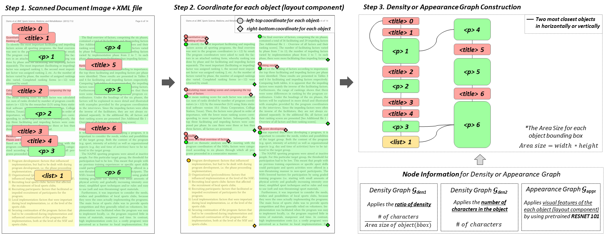
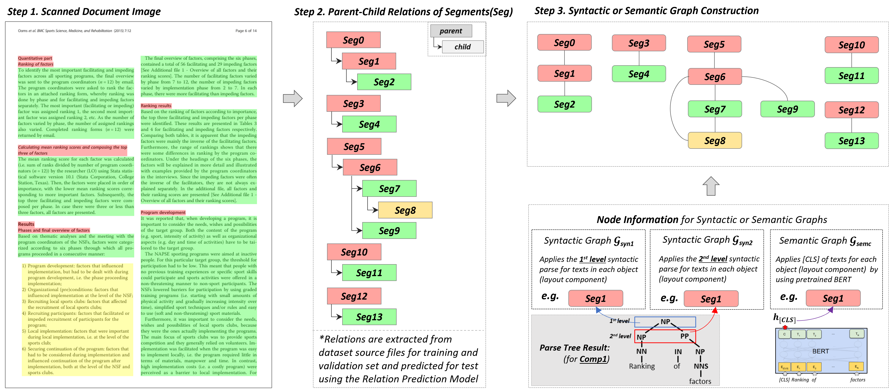

# Doc-GCN: Heterogeneous Graph Convolutional Networks for Document
Layout Analysis
This repository contains code for the paper [Doc-GCN: Heterogeneous Graph Convolutional Networks for Document
Layout Analysis.](https://arxiv.org/abs/2208.10970)

__
Siwen Luo*, Yihao Ding*, Siqu Long, Soyeon Caren Han, Josiah Poon
__

## Dataset Prepare
This paper uses three widely used benchmark datasets, including [FUNSD](https://guillaumejaume.github.io/FUNSD/) ([paper](https://arxiv.org/pdf/1905.13538.pdf)), [Publaynet](https://github.com/ibm-aur-nlp/PubLayNet) ([paper](https://arxiv.org/abs/1908.07836)), and [Docbank](https://github.com/doc-analysis/DocBank) ([paper](https://arxiv.org/abs/2006.01038)). (All three datasets are publicly available and can be gotten via their officially provided download link.)

Before feeding into various graphs to get enhanced feature representation, some preprocessing procedures are required to generate multi-aspect feature representations. Detailed procedure please refer [here](https://github.com/adlnlp/doc_gcn/tree/main/preprocessing). For Publaynet dataset, we use [Google Cloud Vision OCR](https://cloud.google.com/vision/?utm_source=google&utm_medium=cpc&utm_campaign=japac-AU-all-en-dr-bkws-all-super-trial-e-dr-1009882&utm_content=text-ad-none-none-DEV_c-CRE_529584135985-ADGP_Hybrid%20%7C%20BKWS%20-%20EXA%20%7C%20Txt%20~%20AI%20%26%20ML%20~%20Vision%20AI_Vision-google%20ocr-KWID_43700030970538289-aud-1596662388894%3Akwd-12194465573&userloc_9070544-network_g&utm_term=KW_google%20ocr&gclid=Cj0KCQjwguGYBhDRARIsAHgRm48E2LOroBKRCERghKNmc7fVrP7VargWy2yTRMXcYQ6ihAowQkqI-A4aAtX4EALw_wcB&gclsrc=aw.ds) tool  to extract the text content before we feed into the pre-trained BERT to get textual representations. 

### Acquire Multi-aspect Features
We provide a [tutorial](https://colab.research.google.com/drive/1nyP2Ch8CzkKhzN_7OSNRxldLqUvKTetq?usp=sharing) to show how to generate an appropriate json file on FUNSD dataset for training or get GCN enhanced representation by our pre-trained GCN models. Other two datasets could follow the same procedure to get the required format json file for the following procedures. Please refer our [paper](https://arxiv.org/abs/2006.01038) to see the detailed descriptions of node and edge representations and check the [google colab notebook](https://cloud.google.com/vision/?utm_source=google&utm_medium=cpc&utm_campaign=japac-AU-all-en-dr-bkws-all-super-trial-e-dr-1009882&utm_content=text-ad-none-none-DEV_c-CRE_529584135985-ADGP_Hybrid%20%7C%20BKWS%20-%20EXA%20%7C%20Txt%20~%20AI%20%26%20ML%20~%20Vision%20AI_Vision-google%20ocr-KWID_43700030970538289-aud-1596662388894%3Akwd-12194465573&userloc_9070544-network_g&utm_term=KW_google%20ocr&gclid=Cj0KCQjwguGYBhDRARIsAHgRm48E2LOroBKRCERghKNmc7fVrP7VargWy2yTRMXcYQ6ihAowQkqI-A4aAtX4EALw_wcB&gclsrc=aw.ds) to see how to generate them. 

## Graph Construction
We use GCNs to enhance the proposed four aspect feature representations: Appearance, Density, Semantic and Syntactic. Those GCNs have the [same architecture](https://github.com/adlnlp/doc_gcn/blob/main/gcns/gnn_model_structure.py) but different node and edge representations. We are generally classified into two types based on distinct edge representations：

### Appearance and Density Graphs (Gap-distance Weighted)
The first type is gap distance based of including apprearance and density graphs of which edge features is the inverse of the nearest-top k segments. Node features of this type are visual and density features of each segment, repectively. 

### Semantic and Syntactic Graphs (Parent-Child based)
Another type is the parent-child relation based. If two segments have parent-child relation, the edge value is set to be 1, otherwise 0. The graph construction workflow can be found in below graphs. More detailed information can be found in our paper. 

## Classifier
After get the enhance the feature representations, we feed them into [our model]() for training and testing. We also provide an [ipynb notebook]() to show how it works on FUNSD dataset. 

## Evaluation Results

## Case Study

