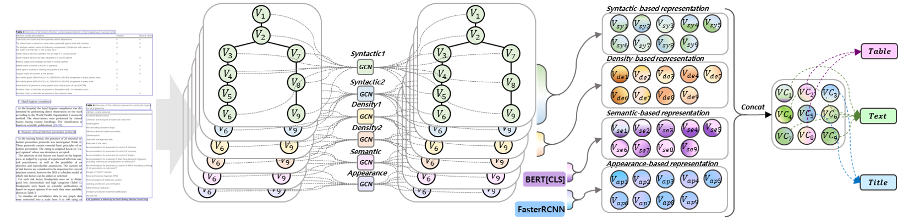

# Doc-GCN: Heterogeneous Graph Convolutional Networks for Document
Layout Analysis
This repository contains code for the paper [Doc-GCN: Heterogeneous Graph Convolutional Networks for Document
Layout Analysis.](https://arxiv.org/abs/2208.10970)

__
Siwen Luo*, Yihao Ding*, Siqu Long, Soyeon Caren Han, Josiah Poon
__

